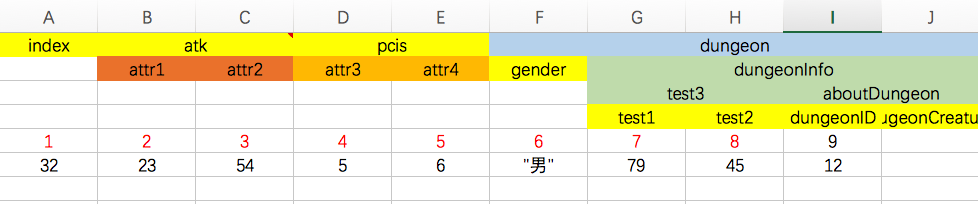

# Python解析Excel导出lua配置表

## 1.使用路径
没有配置python的执行路径，需要在Excel的同级目录执行

## 2.配置需要导出的config信息

```python
# 此处配置excel文件名和导出的lua文件名
configDic = {
	"test.xlsx": "test.lua",
}
```

## 3.嵌套结构的Excel配置

如果一个属性包含二级属性，则在该属性下新建一行表头，表明二级属性名称，如下图所示



解析出来的表结构如下:
```xml
local config = {
	{index = 1, atk = {attr1 = 2, attr2 = 3, }, pcis = {attr3 = 4, attr4 = 5, }, dungeon = {gender = 6, dungeonInfo = {test3 = {test1 = 7, test2 = 8, }, aboutDungeon = {dungeonID = 9, }, }, }, }, 
	{index = 32, atk = {attr1 = 23, attr2 = 54, }, pcis = {attr3 = 5, attr4 = 6, }, dungeon = {gender = "男",dungeonInfo = {test3 = {test1 = 79, test2 = 45, }, aboutDungeon = {dungeonID = 12, }, }, }, }, 
}
return config
```